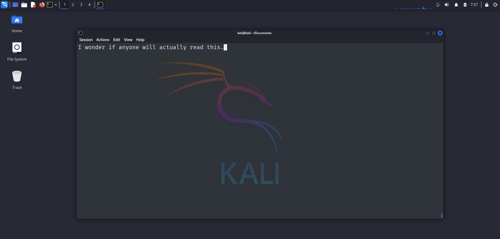

# rawedit

A minimal terminal-based text editor written in C using raw mode and UTF-8 aware input handling.

---

## ✨ Features

- Raw mode input handling using `termios`
- Arrow key navigation (left/right)
- UTF-8 aware cursor movement
- Insert and delete (backspace) support
- New line support
- File load and save functionality
- Lightweight and fast

---

## 🖼️ Preview



---

## ⚙️ Installation

Clone the repository:

```bash
git clone https://github.com/yourusername/rawedit.git
cd rawedit
